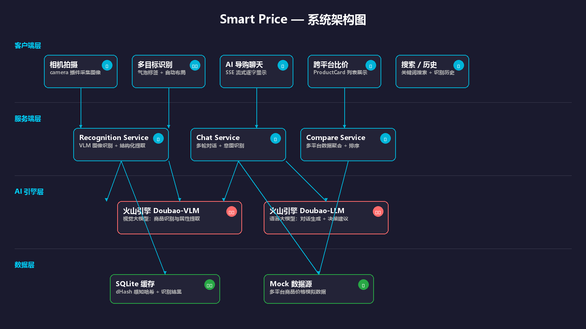

# 📸 Smart Price — AI 拍照识物购物助手

> **面向 C 端消费者的 AI 拍照识物购物助手**
>
> 一拍即识 · 智能导购 · 跨平台比价
>
> **技术栈**：Flutter 3.24 · FastAPI + Python 3.13 · 火山引擎 Doubao · 状态：可运行

---

## 📖 项目简介

**Smart Price** 是一款面向 C 端消费者的 **AI 拍照识物购物助手**。

用户通过 App 内相机拍摄商品照片，服务端利用**大模型视觉能力**（VLM）完成商品类目与关键属性（品牌、颜色、款式等）识别，并**动态生成**下一步决策建议卡片。用户点击建议卡片后，系统跨平台匹配相似商品并输出推荐列表；同时支持用户通过**自然语言**追加筛选条件，AI 购物助手实时响应，辅助用户高效完成购买决策。

> 💡 本项目为**个人独立开发**，前后端、UI 设计、AI 任务编排、Prompt 工程均由一人完成。

---

## ✨ 核心亮点

### 1️⃣ 多目标识别 + 气泡标签可视化

传统拍照识物只能识别画面中的**单一商品**。Smart Price 支持**一张图识别多个商品**，并通过**气泡标签 + 连接线 + 自动避碰布局**在图片上直观标注每个商品的位置和名称。

- 基于 VLM 的多目标检测与属性提取
- 智能布局算法：自动上下翻转、水平避碰、边缘吸附
- 精致的深色卡片气泡 + easeOutBack 弹入动画 + 锚点脉冲效果

### 2️⃣ SSE 流式 AI 聊天（逐字显示）

AI 导购对话采用 **Server-Sent Events (SSE)** 流式传输，用户发送消息后 AI 回复**逐字显示**，消除等待焦虑，体验媲美 ChatGPT。

- 后端：FastAPI StreamingResponse + 火山引擎 Doubao 流式 API
- 前端：HTTP SSE 客户端逐行解析，字符级追加渲染
- 支持决策卡片动态生成（对比分析 / 购买指南 / AI 决策报告）

### 3️⃣ 感知哈希缓存优化（dHash）

针对"同一商品重新拍照"场景，采用 **dHash 差值感知哈希**替代 MD5，配合图片压缩预处理，实现：

- **首次识别**：~8-10 秒（VLM 调用）
- **二次识别（缓存命中）**：**< 0.1 秒**
- 连接池复用 + 图片压缩（600px / JPEG 75%），传输体积减少 30-40%

### 4️⃣ 完整的 AI 任务编排体系

不止于简单的 API 调用，项目构建了完整的 **AI Pipeline**：

| 模块 | AI 任务 | 输出 |
|------|---------|------|
| 商品识别 | VLM 图像理解 + 结构化提取 | 品牌、类目、颜色、款式 |
| 智能导购 | 多轮对话 + 意图识别 | 决策卡片（对比/指南/报告）|
| 决策报告 | 上下文聚合 + 结构化生成 | 最优选择 + 购买建议 |

Prompt 设计具备良好鲁棒性，通过 JSON Schema 约束 + 容错回退机制，确保稳定输出结构化数据。

---

## 🏗️ 系统架构



> 架构说明详见 [`docs/architecture.md`](docs/architecture.md)

---

## 🚀 快速启动

### 环境要求

| 组件 | 版本要求 | 说明 |
|------|---------|------|
| Python | ≥ 3.10 | 后端运行环境 |
| Flutter | ≥ 3.24 | 前端运行环境 |
| Android SDK | API 34+ | 真机调试 |
| 火山引擎 API Key | — | 大模型调用（识别 + 聊天）|

### 1. 克隆项目

```bash
git clone https://github.com/Ryan-wu-web/smart_price_ai.git
cd smart_price_ai
```

### 2. 启动后端

```bash
cd backend

# 创建虚拟环境
python -m venv .venv
source .venv/bin/activate  # Windows: .venv\Scripts\activate

# 安装依赖
pip install -r requirements.txt

# 配置环境变量
cp .env.example .env
# 编辑 .env 文件，填入以下必填项：
```

**`.env` 必填配置**：

| 配置项 | 说明 | 获取方式 |
|--------|------|---------|
| `VOLCENGINE_API_KEY` | 火山引擎 API Key | [火山引擎控制台](https://console.volcengine.com) → 密钥管理 |
| `VOLCENGINE_ENDPOINT` | 模型推理端点 | 默认：`https://ark.cn-beijing.volces.com/api/v3/chat/completions` |
| `VOLCENGINE_MODEL` | 模型 Endpoint ID | 控制台 → 模型推理 → 创建 Endpoint → 复制 ID |

**`.env` 完整示例**：

```env
# 火山引擎配置（必填）
VOLCENGINE_API_KEY=sk-xxxxxxxxxxxxxxxxxxxxxxxxxxxxxxxx
VOLCENGINE_ENDPOINT=https://ark.cn-beijing.volces.com/api/v3/chat/completions
VOLCENGINE_MODEL=ep-xxxxxxxxxxxxx

# 数据库配置（可选，默认使用 SQLite）
DATABASE_URL=sqlite:///./smartprice.db

# 调试模式
DEBUG=true
```

```bash
# 启动服务
uvicorn app.main:app --host 0.0.0.0 --port 8000
```

服务启动后访问 http://localhost:8000/docs 查看 Swagger API 文档。

### 3. 启动前端（真机调试）

```bash
cd android-app

# 安装依赖
flutter pub get

# 配置 API 地址
# 编辑 lib/utils/constants.dart，将 apiBaseUrl 改为电脑局域网 IP

# 连接真机，启动
flutter run
```

### 4. 最小功能验证

按以下路径快速验证核心功能：

1. **拍照识物**：首页 → 拍照识物 → 拍摄商品 → 查看识别结果 → 查看比价 → 价格走势 → AI 导购
2. **多目标识别**：首页 → 多目标识别 → 拍摄多个商品 → 点击气泡标签 → 查看单个商品详情
3. **AI 聊天**：首页 → 底部「聊天」→ 发送 "帮我选一双运动鞋" → 观察决策卡片 → 生成报告

---

## 📚 项目文档

| 文档 | 说明 |
|------|------|
| [`docs/architecture.md`](docs/architecture.md) | 系统架构设计文档（架构图 + 数据流 + 模块边界）|
| [`docs/api.md`](docs/api.md) | API 接口说明文档（RESTful API 详细定义）|
| [`docs/mock-data.md`](docs/mock-data.md) | 商品模拟数据说明（使用模拟数据的原因与格式）|
| [`docs/ai-summary.md`](docs/ai-summary.md) | AI 使用总结文档（Prompt 工程 + AI Coding 实践）|
| [`docs/test/2025-06-05-full-test-plan.md`](docs/test/2025-06-05-full-test-plan.md) | 全功能测试流程与报告 |

---

## 🛠️ 技术栈

### 客户端

| 技术 | 用途 |
|------|------|
| Flutter 3.24 | 跨平台 UI 框架 |
| camera 插件 | 摄像头图像采集 |
| http / SSE | 网络请求与流式通信 |
| CustomPainter | 气泡标签、连接线、扫描线等自定义绘制 |

### 服务端

| 技术 | 用途 |
|------|------|
| FastAPI | RESTful API 框架 |
| SQLite | 识别结果缓存与历史记录 |
| httpx | 异步 HTTP 客户端（连接池复用）|
| Pillow | 图片压缩与 dHash 感知哈希计算 |
| 火山引擎 Doubao | VLM 图像识别 + LLM 对话生成 |

---

## ⚠️ 常见问题

**Q1：后端启动后手机无法访问？**

确保手机和电脑在同一 WiFi 下，且防火墙未拦截 8000 端口。将 `constants.dart` 中的 `apiBaseUrl` 改为电脑的**局域网 IP**（如 `http://192.168.1.xxx:8000`）。

**Q2：拍照后识别超时？**

首次识别需要调用 VLM API（约 8-10 秒），请确保火山引擎 API Key 有效且余额充足。同一商品二次拍照会命中缓存（< 0.1 秒）。

**Q3：Flutter 编译报错？**

执行 `flutter clean && flutter pub get` 后重试。确保 Flutter SDK 版本 ≥ 3.24，`android/app/build.gradle` 中 `compileSdkVersion` 为 34。

---

## 📄 许可证

MIT License © 2025 Smart Price
