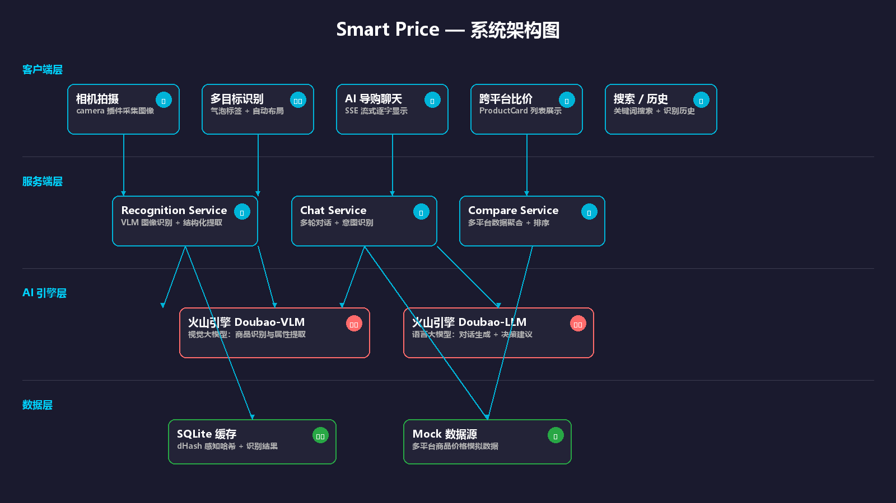

# 📸 Smart Price — AI 拍照识物购物助手

> **面向 C 端消费者的 AI 拍照识物购物助手**
>
> 一拍即识 · 智能导购 · 跨平台比价
>
> 
> 
> 
> 

---

## 📖 项目简介

**Smart Price** 是一款面向 C 端消费者的 **AI 拍照识物购物助手**。

用户通过 App 内相机拍摄商品照片，服务端利用**大模型视觉能力**（VLM）完成商品类目与关键属性（品牌、颜色、款式等）识别，并**动态生成**下一步决策建议卡片。用户点击建议卡片后，系统从本地样例数据匹配相似商品并输出模拟平台推荐列表；同时支持用户通过**自然语言**追加筛选条件，AI 购物助手实时响应，辅助用户高效完成购买决策。

> 💡 本项目为**个人独立开发**，前后端、UI 设计、AI 任务编排、Prompt 工程均由一人完成。

> **当前状态（2026-09-11）**：已完成代码整理及 Phase 1A–1C 的识别缓存、模型连接池、会话上下文和 SSE 协议修复，通过离线工程检查与本地模型桩 HTTP 流验证。Phase 2A 已新增18条固定虚构商品知识、只读查询与证据追溯接口；尚未接入 Flutter、聊天或旧比价链路。Phase 2B 已实现可追溯混合检索（BM25＋字符TF-IDF、融合及重排），但不是预训练语义Embedding，也不是完整推荐链路。Phase 3–5 尚未完成，其他业务 Schema 将随相应模块收紧。商品、平台报价和价格走势均为本地模拟数据，不代表实时全网比价、全网最低价或真实历史价格。真实模型、真机效果与产品评测指标尚未验证。

---

## ✨ 核心亮点

### 1️⃣ 多目标识别 + 气泡标签可视化

传统拍照识物只能识别画面中的**单一商品**。Smart Price 支持**一张图识别多个商品**，并通过**气泡标签 + 连接线 + 自动避碰布局**在图片上直观标注每个商品的位置和名称。

- 基于 VLM 的多目标检测与属性提取
- 智能布局算法：自动上下翻转、水平避碰、边缘吸附
- 精致的深色卡片气泡 + easeOutBack 弹入动画 + 锚点脉冲效果

### 2️⃣ SSE 流式 AI 聊天（真实分块增量）

AI 导购对话采用 **Server-Sent Events (SSE)**：文字随模型分块到达就显示，不等待整段 JSON，也不添加人为逐字延迟。增量是临时内容，最终结构校验、保存并收到成功结束事件后才展示完成状态。

- 后端：FastAPI StreamingResponse + 火山引擎 Doubao 流式 API
- 前端：按完整 SSE 帧解析，区分 `delta/status/result/error/end`，检查事件顺序与终态
- 展示整理上下文、生成回复、校验、保存状态；超时／断流友好提示，退出聊天页取消请求
- 不自动重发流式 POST；协议与时限见 [API 说明](docs/api.md#sse-v1-事件协议)
- 支持决策卡片动态生成（对比分析 / 购买指南 / AI 决策报告）

### 3️⃣ 单／多目标隔离的精确缓存

缓存使用**原始图片字节 SHA-256 + 任务模式 + 模型／端点 + 版本**，不再用 dHash 判断图片相同，避免不同图片误命中。

- 单目标与多目标分别校验、原子写入，TTL 为 7 天；旧缓存自然忽略，不批量删除。
- 图片按 EXIF 方向旋转，转为 RGB，最长边缩至 600px，JPEG 质量 75%。
- 应用级 HTTP 连接池由 FastAPI lifespan 创建与关闭；缓存命中无需模型请求。
- 精确缓存不保证重新拍照或重新编码后命中；正确性优先于近似命中率。

### 4️⃣ 完整的 AI 任务编排体系

不止于简单的 API 调用，项目构建了完整的 **AI Pipeline**：

| 模块 | AI 任务 | 输出 |
|------|---------|------|
| 商品识别 | VLM 图像理解 + 结构化提取 | 品牌、类目、颜色、款式 |
| 智能导购 | 多轮对话 + 意图识别 | 决策卡片（对比/指南/报告）|
| 决策报告 | 上下文聚合 + 结构化生成 | 最优选择 + 购买建议 |

Phase 1A 已完成识别 Schema、缓存隔离和共享 HTTP；Phase 1B 已为对话输入、回复、摘要和商品上下文增加 Schema，修复摘要丢历史并原子保存会话。Phase 1C 增加经 Pydantic 校验的 SSE 事件和增量解析。其他业务专用 Schema 随后续商品检索／报告模块收紧。

---

## 🏗️ 系统架构



> 当前实现边界见 [架构说明](docs/architecture.md)、[API 说明](docs/api.md) 和 [模块交付索引](docs/modules/README.md)。

---

## 🚀 快速启动

### 环境要求

| 组件 | 版本要求 | 说明 |
|------|---------|------|
| Python | ≥ 3.10 | 后端运行环境 |
| Flutter | ≥ 3.24 | 前端运行环境 |
| Android SDK | API 34+ | 真机调试 |
| 火山引擎 API Key | — | 大模型调用（识别 + 聊天）|

### 1. 克隆项目

```bash
git clone https://github.com/Ryan-wu-web/smart_price_ai.git
cd smart_price_ai
```

### 2. 启动后端

```bash
cd backend

# 创建虚拟环境
python -m venv .venv
source .venv/bin/activate  # Windows: .venv\Scripts\activate

# 安装依赖
pip install -r requirements.txt

# 配置环境变量
cp .env.example .env
# 编辑 .env 文件，填入以下必填项：
```

**`.env` 必填配置**：

| 配置项 | 说明 | 获取方式 |
|--------|------|---------|
| `VOLCENGINE_API_KEY` | 火山引擎 API Key | [火山引擎控制台](https://console.volcengine.com) → 密钥管理 |
| `VOLCENGINE_ENDPOINT` | 模型推理端点 | 默认：`https://ark.cn-beijing.volces.com/api/v3/chat/completions` |
| `VOLCENGINE_MODEL` | 模型 Endpoint ID | 控制台 → 模型推理 → 创建 Endpoint → 复制 ID |

**`.env` 完整示例**：

```env
# 火山引擎配置（必填）
VOLCENGINE_API_KEY=your-api-key-here
VOLCENGINE_ENDPOINT=https://ark.cn-beijing.volces.com/api/v3/chat/completions
VOLCENGINE_MODEL=ep-xxxxxxxxxxxxx

# 数据库配置（可选；当前主流程未接入数据库）
DATABASE_URL=sqlite:///./smartprice.db

# 调试模式
DEBUG=true
```

```bash
# 本地会话使用进程内锁，请保持单进程，不添加 --workers
uvicorn app.main:app --host 0.0.0.0 --port 8000
```

服务启动后访问 http://localhost:8000/docs 查看 Swagger API 文档。

本地基础功能不要求 Redis 或 PostgreSQL 已启动；当前它们未进入主链路。
没有模型配置时 `/health` 和 `/api/v1/knowledge/*` 本地样例商品接口可用，但真实识别／对话不可用。
连接池及 JSON 修复参数见 `backend/.env.example` 和 [API 说明](docs/api.md)。
已验证隔离 ASGI 接口、离线模型桩，以及本地 Uvicorn 启动／健康接口／OpenAPI；没有执行真实模型、真机或 Docker 构建。

会话文件位于从 `backend` 启动时的 `data/sessions`。请保留该目录且仅运行一个后端进程；本模块兼容旧历史数组，成功回复后自动写入版本 2，坏文件保留并报错。回退旧代码前须备份该目录，新格式不能直接交给旧版本读取。会话 ID 并非登录凭证，目前没有账号级隔离，不宜直接向公网开放。

### 无模型配置也可验证：固定样例商品知识库（Phase 2A）

后端启动后，另开一个 PowerShell 窗口：

```powershell
# 查询全部固定样例（默认每页20条，目前共18条）
$catalog = Invoke-RestMethod 'http://127.0.0.1:8000/api/v1/knowledge/products'
$catalog.catalog
$catalog.products | Select-Object product_id, name, category, evidence_id

# 查商品及其证据，无须 API Key、Redis 或 PostgreSQL
Invoke-RestMethod 'http://127.0.0.1:8000/api/v1/knowledge/products/sample-shoe-01'
Invoke-RestMethod 'http://127.0.0.1:8000/api/v1/knowledge/evidence/ev-shoe-01'
```

数据随代码保存在 `backend/app/catalog/sample-products.v1.json`，不属于可删除的运行缓存。
18条记录覆盖运动鞋、耳机、双肩包，品牌、参数和人民币价格均是**虚构工程样例**，不是厂商事实或在售报价。
所有响应附带样例声明、数据集版本和文件 SHA-256；证据还带商品 ID、来源与 JSON Pointer。
按品类／品牌查询是精确 Metadata 筛选，不是 RAG 或推荐排序，空结果不放宽条件。

该库暂未替换旧 `comparison.py` 随机 Mock，也未接入 Flutter／聊天；**不能据此宣称现有推荐已具备证据**。
本模块没有新环境变量和数据库迁移。修改样例后递增 `revision` 并重启后端；坏文件只让知识接口返回503，不回退到随机商品。
详见 [知识接口](docs/api.md#固定样例商品知识库phase-2a) 与 [2A 交付记录](docs/modules/02a-product-knowledge.md)。

### 查询样例知识证据（Phase 2B）

后端启动后，在 PowerShell 执行：

```powershell
$body = @{ query = '雨天通勤'; category = '运动鞋'; top_k = 5 } | ConvertTo-Json
$result = Invoke-RestMethod -Method Post -Uri 'http://127.0.0.1:8000/api/v1/knowledge/search' `
  -ContentType 'application/json; charset=utf-8' -Body ([Text.Encoding]::UTF8.GetBytes($body))
$result.hits | Select-Object product_id, name, score, matched_fields
$result.hits[0].evidence | Format-List field, locator, value, role
$result.warnings
```

这是**相关资料检索**，不是最终购物推荐：`score`是检索相关性，不是置信度或条件满足率。
品类／品牌先精确过滤，再执行BM25和字符TF-IDF双路召回、商品级名次融合及确定性重排。
缺点、排斥场景、false及null也可能命中，证据保留原值；不要仅因出现“防水”一词就认定该商品支持防水。
字符向量无需下载模型，但不具备预训练语义理解，短词、同义改写和库外商品可能漏召回。

无需新依赖／环境变量／数据库，索引随当前固定快照在启动时构建。参数集中于 `backend/app/core/retrieval_config.py`。
索引故障仅让搜索接口503，已有知识查询可继续；修改参数后重启，用响应`index.fingerprint`辨别索引配置。
尚未接入Flutter和聊天，未完成预算／功能硬约束与购物偏好排序；不能把检索命中直接当购买建议。
详见 [检索API](docs/api.md#样例知识混合检索phase-2b) 和 [2B交付记录](docs/modules/02b-hybrid-retrieval.md)。

### 3. 启动前端（真机调试）

```bash
cd android-app

# 安装依赖
flutter pub get

# 配置 API 地址
# 编辑 lib/utils/constants.dart，将 apiBaseUrl 改为电脑局域网 IP

# 连接真机，启动
flutter run
```

### 4. 最小功能验证

按以下路径快速验证核心功能：

1. **拍照识物**：首页 → 拍照识物 → 拍摄商品 → 查看识别结果 → 查看比价 → 价格走势 → AI 导购
2. **多目标识别**：首页 → 多目标识别 → 拍摄多个商品 → 点击气泡标签 → 查看单个商品详情
3. **识别后追问**：识别详情修正属性 → 输入问题 → 聊天显示已带入商品 → 再追问材质／预算；没有价格不会显示为 0 元。
4. **AI 聊天／报告**：首页 → 聊天 → 补充品类、预算和用途；仅在已有样例商品价格／平台时生成价格相关报告。当前尚非证据推荐链路。

---

## 📚 项目文档

| 文档 | 说明 |
|------|------|
| [`docs/modules/README.md`](docs/modules/README.md) | 模块交付记录索引与记录规范 |
| [`docs/modules/00-cleanup.md`](docs/modules/00-cleanup.md) | 升级前清理范围、验证、回退与后续边界 |
| [`docs/modules/01a-recognition-foundation.md`](docs/modules/01a-recognition-foundation.md) | Phase 1A 实际改动、离线结果与复现方式 |
| [`docs/modules/01b-conversation-context.md`](docs/modules/01b-conversation-context.md) | Phase 1B 会话、摘要、识别上下文与实际验证 |
| [`docs/modules/01c-streaming-protocol.md`](docs/modules/01c-streaming-protocol.md) | Phase 1C SSE 协议、客户端消费与实际验证 |
| [`docs/api.md`](docs/api.md) | 现有接口、识别字段及错误约定 |
| [`docs/architecture.md`](docs/architecture.md) | 当前运行链路与尚未完成的架构部分 |

---

## 🛠️ 技术栈

### 客户端

| 技术 | 用途 |
|------|------|
| Flutter 3.24 | 跨平台 UI 框架 |
| camera 插件 | 摄像头图像采集 |
| http / SSE | 网络请求与流式通信 |
| CustomPainter | 气泡标签、连接线、扫描线等自定义绘制 |

### 服务端

| 技术 | 用途 |
|------|------|
| FastAPI | RESTful API 框架 |
| 内存／本地 JSON 文件 | 当前识别缓存与会话存储；SQLAlchemy 数据模型尚未接入主流程 |
| httpx | 应用级异步连接池、分项超时与生命周期关闭 |
| Pillow | 图片校验、方向修正与压缩 |
| 火山引擎 Doubao | VLM 图像识别 + LLM 对话生成 |

---

## ⚠️ 常见问题

**Q1：后端启动后手机无法访问？**

确保手机和电脑在同一 WiFi 下，且防火墙未拦截 8000 端口。将 `constants.dart` 中的 `apiBaseUrl` 改为电脑的**局域网 IP**（如 `http://192.168.1.xxx:8000`）。

**Q2：拍照后识别超时？**

首次识别需要调用 VLM API，请确保模型配置有效。响应时间取决于网络、模型和输入图片；仅原始图片字节及模式／模型版本一致时复用精确缓存；重新拍照不保证命中。

**Q3：Flutter 编译报错？**

执行 `flutter clean && flutter pub get` 后重试。确保 Flutter SDK 版本 ≥ 3.24，`android/app/build.gradle` 中 `compileSdkVersion` 为 34。

---

## 📄 许可证

MIT License © 2025 Smart Price
